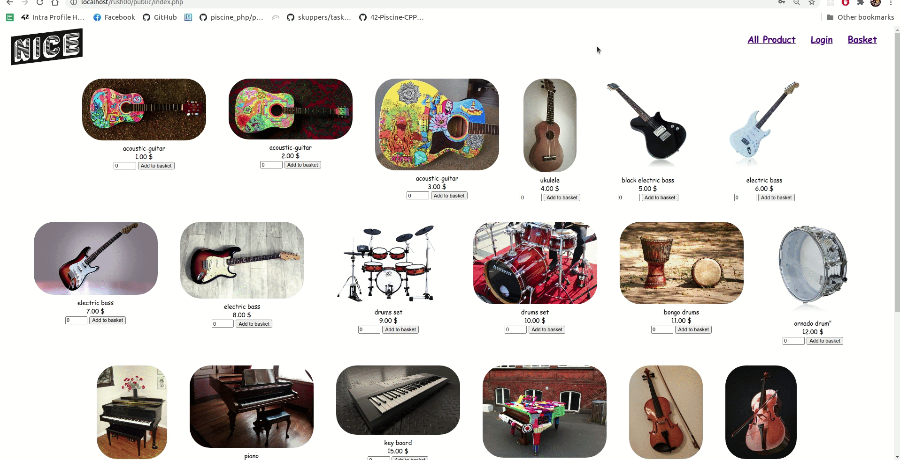

# 🌱 Piscine PHP
<strong>Status: Finished</strong> 
2 intense weeks of diving into the web with PHP, Mysql, JavaScript, Jquery & Ajax
## Results
<ul>
  <li>Day00: 77 🥳</li>
  <li>Day01: 100 🥳</li>
  <li>Day02: 60 🥳</li>
  <li>Day03: 100 🥳</li>
  <li>Day04: 80 🥳</li>
  <li>Day05: 10 😭</li>
  <li>Day06: 36 😭</li>
  <li>Day07: 100 🥳</li>
  <li>Day08: 0 😭</li>
  <li>Day09: 100 🥳</li>
  <li>Rush00: 119 🥳</li>
  <li>Rush01: 0 😭</li>
</ul>

### Rush00:
A mini-ecommerce online shop selling dirt cheap musical instrusments
<i>feature:</i> 
☑️ Data management.  
☑️ User management.  
☑️ A basket.  
☑️ Categories and Associated products.  
☑️ A landing page. 
☑️ Administrative section.  

